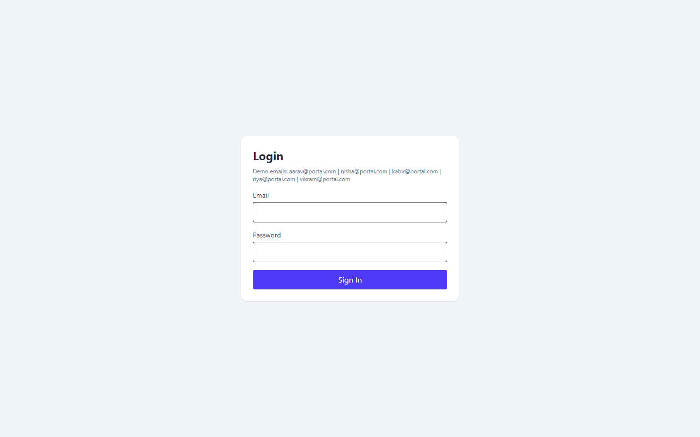
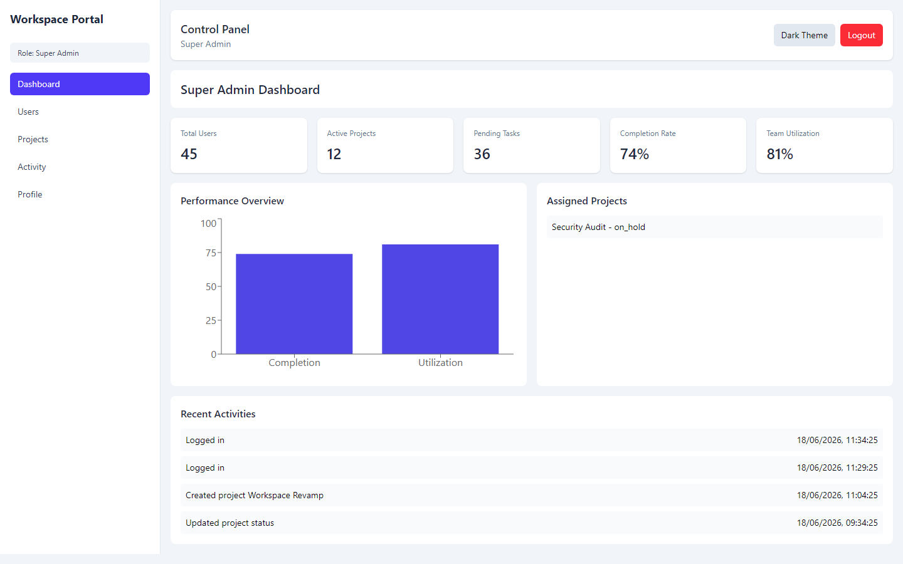
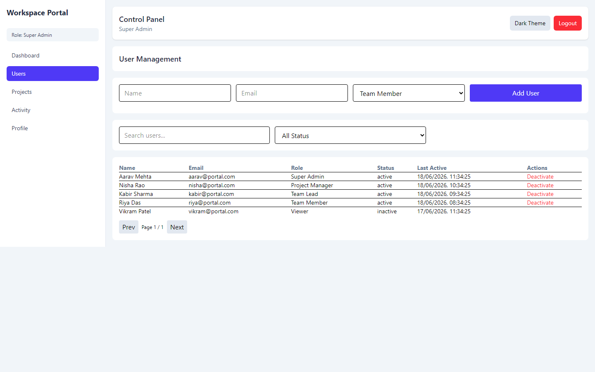
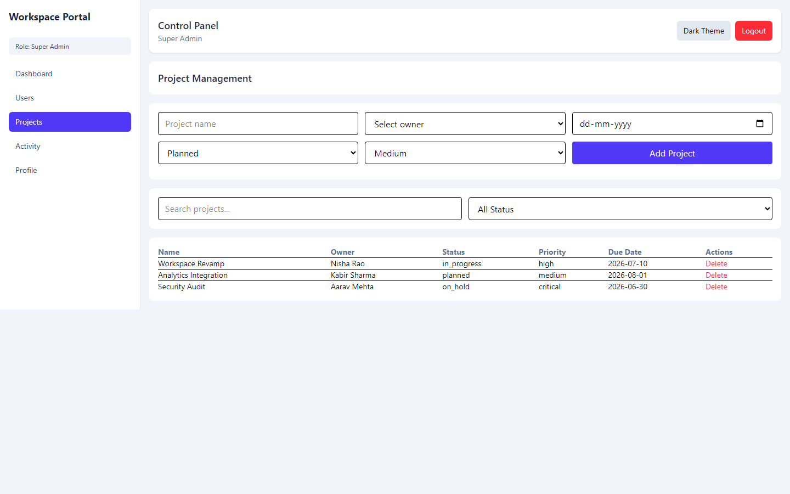
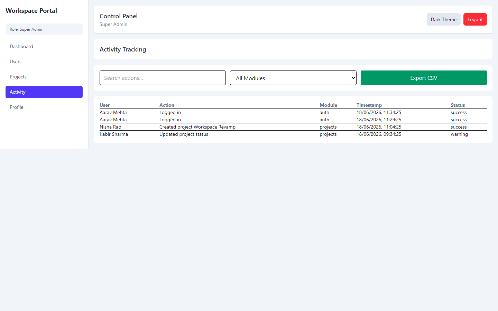
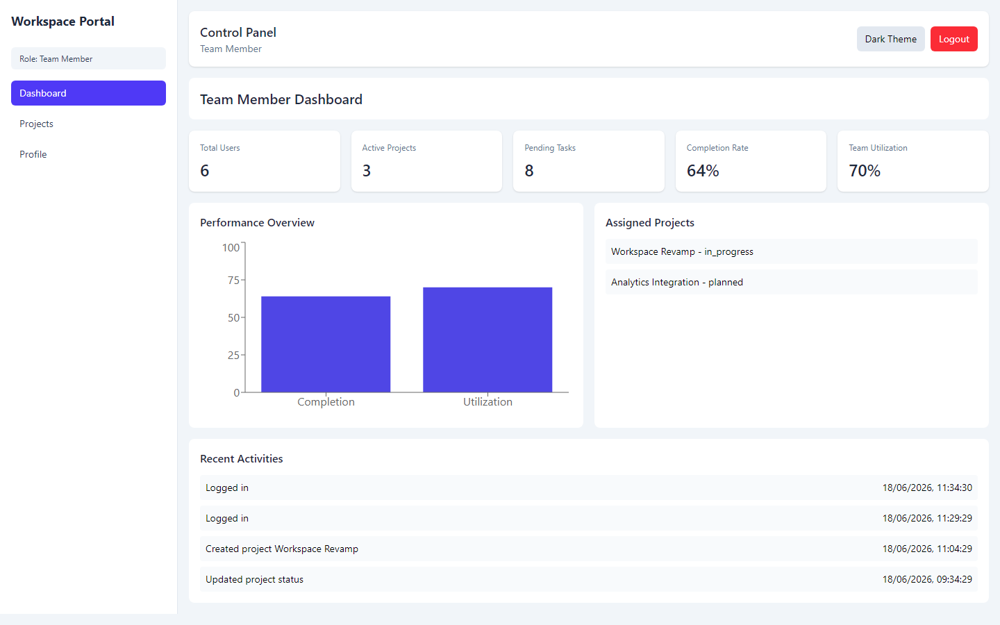

# Multi-Tenant Workspace Management Portal

A TypeScript React portal with authentication, role-based access control (RBAC), dashboard modules, user/project administration, and activity tracking using local mock data.

## Tech Stack

- React + TypeScript
- Tailwind CSS
- React Router DOM v6
- Context API + `useReducer`
- React Hook Form + Zod
- Recharts (dashboard performance chart)

## Setup Instructions

1. Install dependencies:
   ```bash
   npm install
   ```
2. Run development server:
   ```bash
   npm run dev
   ```
3. Build for production:
   ```bash
   npm run build
   ```
4. Lint:
   ```bash
   npm run lint
   ```

## Folder Structure

```text
src/
  assets/
  components/
    DashboardCards.tsx
    Layout.tsx
    ProtectedRoute.tsx
    Sidebar.tsx
    Topbar.tsx
  constants/
    mockData.ts
    navigation.ts
    rbac.ts
  context/
    AppContext.tsx
    app-context.ts
  hooks/
    useAppContext.ts
    usePagination.ts
  pages/
    ActivityPage.tsx
    DashboardPage.tsx
    LoginPage.tsx
    ProfilePage.tsx
    ProjectsPage.tsx
    UsersPage.tsx
  types/
    index.ts
  utils/
    helpers.ts
  App.tsx
  index.tsx
  main.tsx
```

## Features Implemented

- Authentication module with login/logout, validation, session state, and protected routes
- Role-based route permissions, role-specific dashboard landing, and dynamic sidebar menus
- Dashboard module: summary cards, assigned projects, recent activities, performance overview chart
- User management: add/deactivate users, search, filter, and pagination
- Project management: add/delete projects, search, and status filters
- Activity tracking: search, module filter, and CSV export
- Persistent local data/state using Context API + `useReducer` + `localStorage`
- Dark/light theme toggle and responsive layout

## Demo Login Notes

- Use any active mock email shown on the login page.
- Password is validated for length only in this mock implementation.

## Assumptions Made

- No external backend/API; all state is local and persisted to browser storage.
- Route access is enforced by role-to-route mapping.
- Edit flows are represented by reducer support and table actions; add/deactivate/delete are exposed in UI.
- Viewer and Team Member have read-focused permissions.

## Screenshots

1. Login page with validation  
   
2. Super Admin dashboard  
   
3. User management module  
   
4. Project management module  
   
5. Activity tracking with export button  
   
6. Role-restricted view (Team Member)  
   
